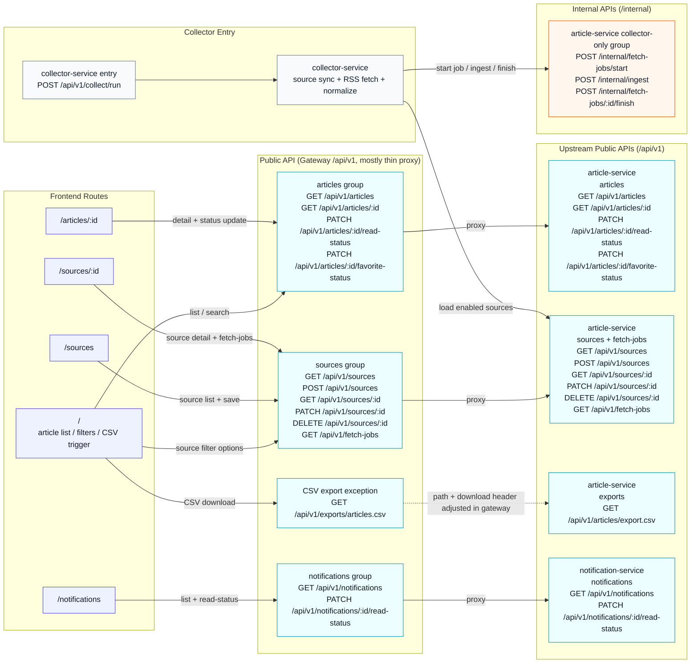

# 公開 API / 内部 API 責務境界図

この図は、frontend の主要 route がどの公開 API group に依存し、その先で `api-gateway`、`article-service`、`notification-service`、`collector-service` がどこで責務分離されているかを 1 枚で把握するためのものです。
通常閲覧導線と collector 導線を分けて示し、`/api/v1` と `/internal` の境界、CSV export の例外経路、OpenAPI 更新や service 境界逸脱の影響点を追いやすくします。

## 補足

- `api-gateway` は通常 `path / query / body / header` を upstream に渡す thin proxy で、CSV export だけ `GET /api/v1/exports/articles.csv -> GET /api/v1/articles/export.csv` と `Content-Disposition` 調整を行う例外です。
- `collector-service` は通常閲覧導線とは別入口で、`GET /api/v1/sources` と `POST /internal/*` を使って `article-service` と連携します。
- `Internal APIs (/internal)` は collector 連携用であり、frontend や `api-gateway` の公開導線には載せていません。

## 主な根拠ファイル

- `frontend/src/main.tsx`
- `frontend/src/lib/api.ts`
- `frontend/src/ui/ArticleListPage.tsx`
- `frontend/src/ui/ArticleDetailPage.tsx`
- `frontend/src/ui/SourceManagementPage.tsx`
- `frontend/src/ui/SourceDetailPage.tsx`
- `frontend/src/ui/NotificationListPage.tsx`
- `services/api-gateway/internal/httpapi/routes.go`
- `services/article-service/internal/httpapi/router.go`
- `services/collector-service/internal/httpapi/routes.go`
- `services/collector-service/internal/collector/service.go`
- `services/notification-service/internal/httpapi/router.go`
- `docs/openapi/api-gateway.summary.md`
- `docs/openapi/article-service-internal.yaml`
