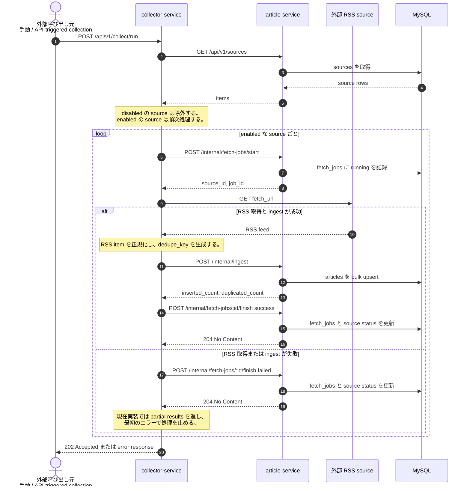

# 記事収集フロー図

この図は、`collector-service` が source 設定を取得してから、fetch job を開始し、RSS を正規化して `article-service` に ingest し、最後に job を完了させるまでの現在実装を示します。
収集の主題は source 同期、逐次処理、job 管理、ingest 契約にあり、起動主体や将来の scheduler は図に含めていません。

## 補足

- `collector-service` は `GET /api/v1/sources` の結果から `is_enabled=true` の source だけを対象にします。
- `article-service` 側で `fetch_jobs` と `sources.last_fetch_status / last_error_message` を更新するため、source 詳細画面と job 履歴画面の整合が保たれます。
- `article-service` は ingest 成功で `inserted_count > 0` のとき `article.ingested` を publish しますが、この図では主題を収集フローに絞っています。

## repo からは未確定

- 定期実行主体、retry / backoff、並列収集ポリシーは repo から確定できないため、この図には含めていません。

## 主な根拠ファイル

- `services/collector-service/internal/httpapi/routes.go`
- `services/collector-service/internal/collector/service.go`
- `services/article-service/internal/httpapi/router.go`
- `services/article-service/internal/service/article_service.go`
- `docs/openapi/article-service-internal.yaml`
- `deployments/compose/mysql/init/001_schema.sql`
