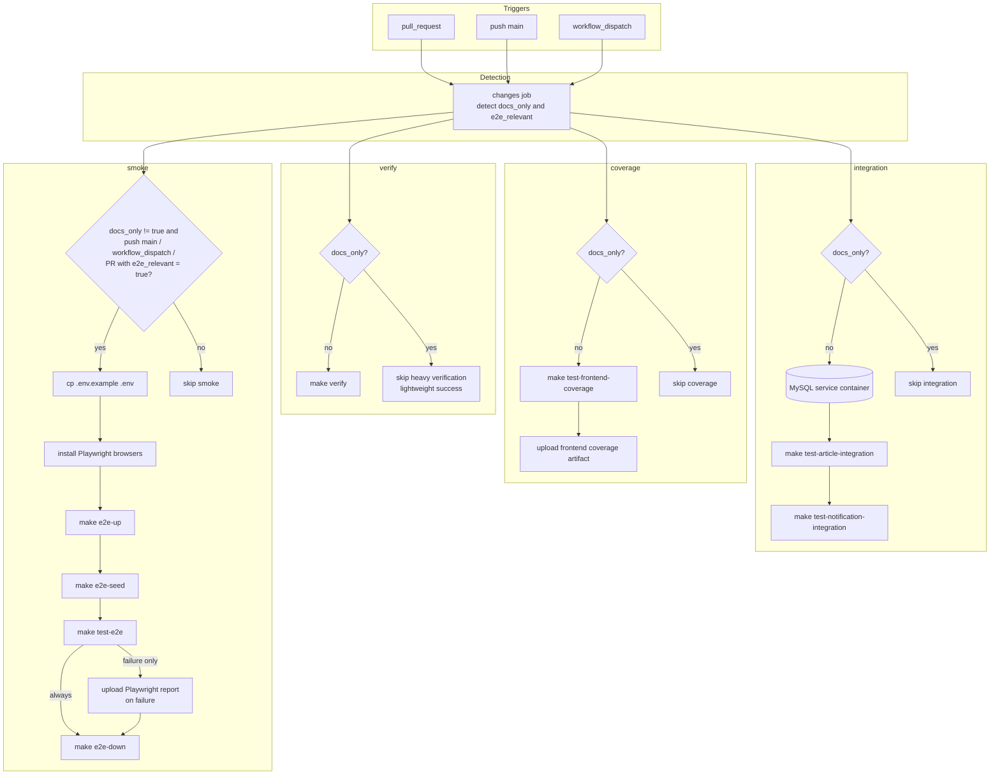

# CI / テストレーン構成図

この図は、GitHub Actions の test-related lanes に絞って、`changes` job の判定結果が `verify`、`integration`、`coverage`、`smoke` にどう影響するかを示します。
通常のコード変更、docs-only 変更、E2E relevant change の違いを、repo 実装に即して把握できるようにしています。

## 補足

- `verify` は workflow 上は常に起動し、docs-only 変更では `make verify` を省略して軽量成功にします。
- `integration` は MySQL service container 付きで article-service と notification-service の integration test を分離実行します。
- `smoke` は docs-only 以外かつ `push main`、`workflow_dispatch`、または `e2e_relevant=true` の PR でだけ走ります。

## repo からは未確定

- branch protection や required checks の GitHub 設定は repo 外にあるため、この図には含めていません。

## 主な根拠ファイル

- `.github/workflows/ci.yml`
- `Makefile`
- `scripts/e2e/wait-for-stack.sh`
- `scripts/e2e/seed.sh`
- `frontend/playwright.config.ts`

## 図に含めていないもの

- `commit-message-check` と `pr-body-check` は別 workflow の PR guardrails のため、この図本体には含めていません。
