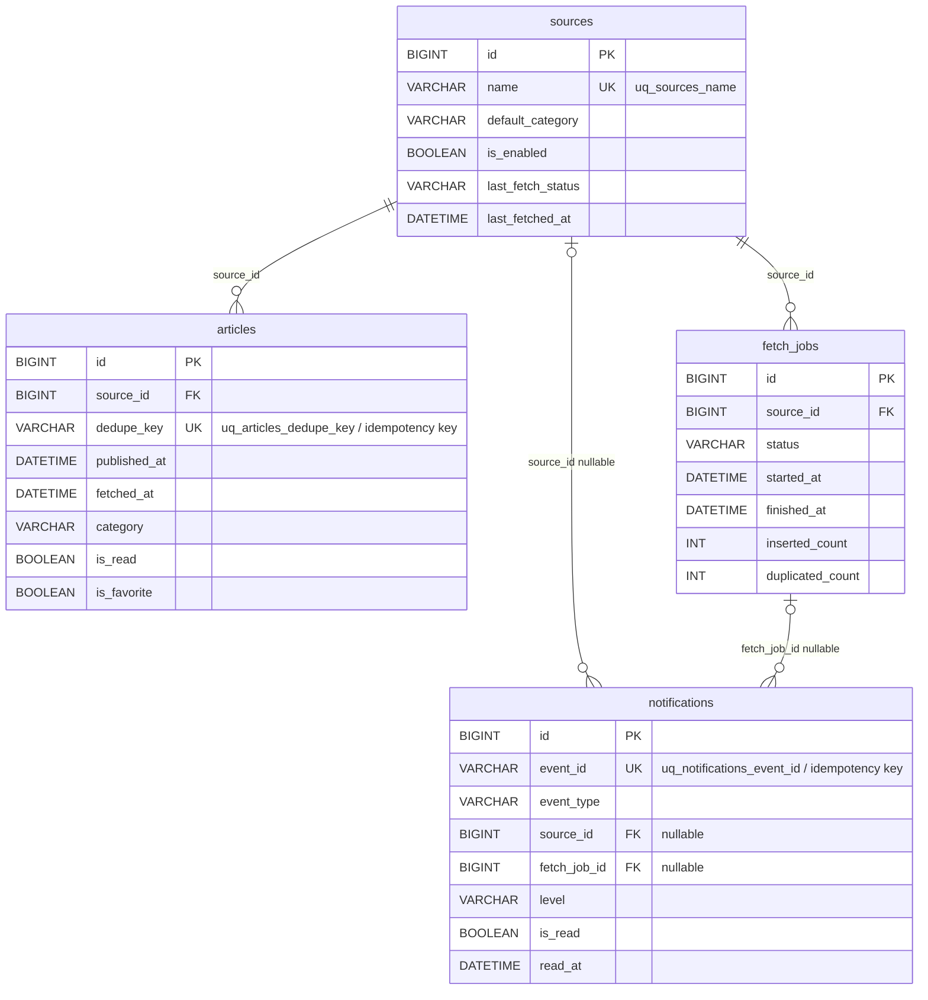

# データモデル / 所有責務 ER 図

この図は、共有 MySQL 上にある `sources`、`articles`、`fetch_jobs`、`notifications` の関係を 1 枚で把握するためのものです。
既存の runtime 図やフロー図とは分けて、静的なデータ構造、FK / unique 制約、service ごとの所有責務に絞っています。
DB 変更レビュー時に、どのテーブルと制約に影響するかを短時間で確認しやすくすることを目的にしています。

## 所有責務の凡例

- `article-service`: `sources`, `articles`, `fetch_jobs`
- `notification-service`: `notifications`
- 補足: 現在は共有 MySQL 上に共存しますが、`collector-service` は DB を直接更新せず `article-service` の public / internal API 経由で状態を変えます。

## 補足

- `articles.dedupe_key` は ingest 時の冪等性キーで、同一記事の重複登録を吸収します。
- `notifications.event_id` は通知保存時の冪等性キーで、同一 event の重複保存を防ぎます。
- `notifications.source_id` と `notifications.fetch_job_id` は schema 上 nullable FK で、通知種別ごとの差異を許容します。
- 図本体からは外していますが、理解に効く index として `articles` の `FULLTEXT(title, excerpt)`、`fetch_jobs` の `(source_id, status, started_at, id)` があります。

## 主な根拠ファイル

- `deployments/compose/mysql/init/001_schema.sql`
- `services/article-service/internal/repository/article_repository.go`
- `services/article-service/internal/repository/source_repository.go`
- `services/article-service/internal/repository/fetch_job_repository.go`
- `services/notification-service/internal/repository/notification_repository.go`
- `services/article-service/internal/service/article_service.go`
- `services/notification-service/internal/service/notification_service.go`
