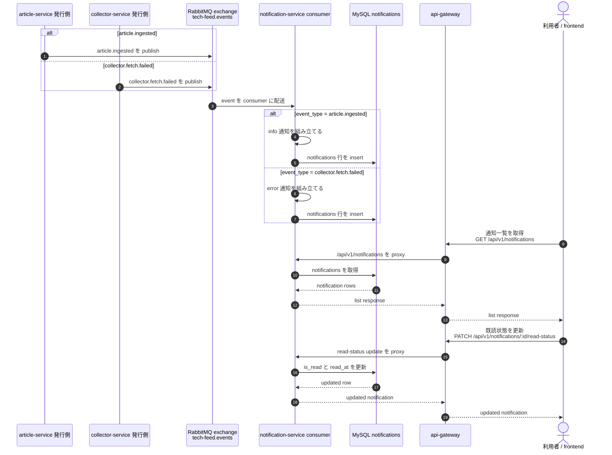

# 通知生成フロー図

この図は、`article.ingested` と `collector.fetch.failed` が RabbitMQ を経由して `notification-service` に取り込まれ、通知一覧 API と既読更新 API を通じて UI に見えるまでの流れを示します。
同期 API と非同期イベント処理の境界を分けて理解しやすくすることを目的にしています。

## 補足

- `notification-service` は event の `event_type` を見て、`info` または `error` の通知レコードを生成します。
- UI の公開導線は `frontend -> api-gateway -> notification-service` で、RabbitMQ は UI から直接は見えません。
- 図では exchange と consumer を主題にしていますが、実装では `notification-service` queue を宣言し、`article.ingested` と `collector.fetch.failed` を bind しています。

## repo からは未確定

- dead-letter queue、max retry、複数 consumer、Slack / email / webhook などの配送先拡張は repo から確定できないため、この図には含めていません。

## 主な根拠ファイル

- `services/article-service/internal/events/publisher.go`
- `services/collector-service/internal/events/publisher.go`
- `services/notification-service/internal/events/contracts.go`
- `services/notification-service/internal/events/consumer.go`
- `services/notification-service/internal/service/notification_service.go`
- `services/api-gateway/internal/httpapi/routes.go`
- `docs/openapi/article.ingested.json`
- `docs/openapi/collector.fetch.failed.json`
