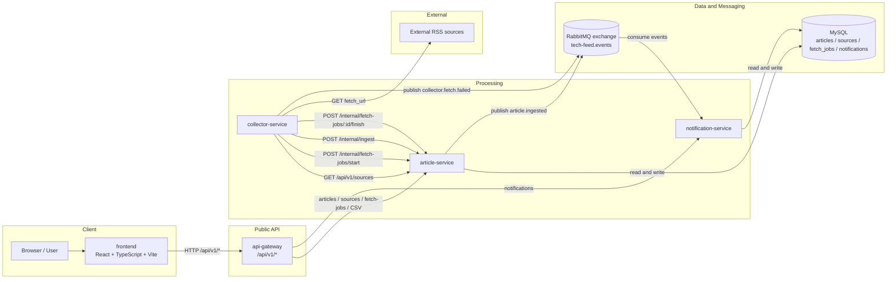

# システム全体構成図

この図は、現在の runtime 構成、公開 API 境界、内部連携、データ / メッセージ基盤を 1 枚で把握するためのものです。
新規参入者や AI エージェントが、どの service がどこに依存し、どの経路が同期 API でどの経路が非同期イベントかを素早く掴めるようにしています。

## 補足

- `collector-service` は `frontend` や `api-gateway` の公開導線には入っておらず、別入口の収集実行 service として存在します。
- `collector-service` は DB を直接触らず、`article-service` の public / internal API を使います。
- `notification-service` は RabbitMQ の consumer であると同時に、通知一覧 / 既読更新 API の upstream でもあります。

## repo からは未確定

- `collector-service` の通常運用での起動主体は repo から確定できないため、この図では表現していません。

## 主な根拠ファイル

- `README.md`
- `docker-compose.yml`
- `services/api-gateway/internal/httpapi/routes.go`
- `services/article-service/internal/app/app.go`
- `services/collector-service/internal/app/app.go`
- `services/collector-service/internal/collector/service.go`
- `services/notification-service/internal/app/app.go`
- `services/notification-service/internal/events/consumer.go`
- `deployments/compose/mysql/init/001_schema.sql`
